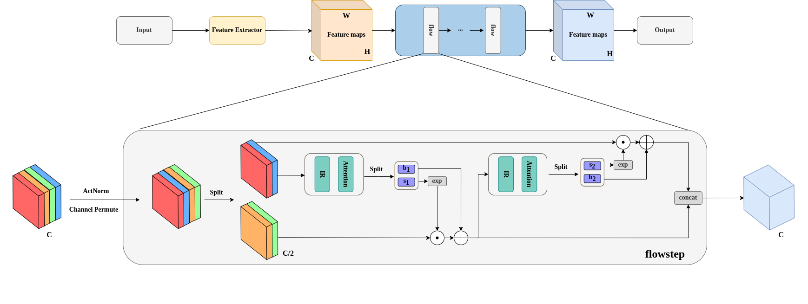
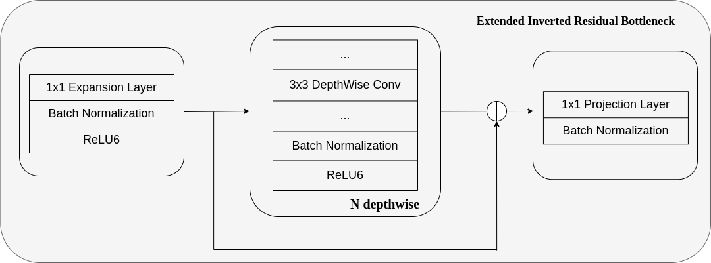

# DANFlow: Depth-wise separable convolution and Attention-based Normalizing Flow
## Key features
- A pipeline for localizing abnormal regions in input images:
  - Feature extraction stage: Extract features from input image using CNN or ViT.
  - 2D Normalizing Flows stage: Estimate the probability density from extracted features.
    - Extended Inverted Residual Bottleneck (EIRB) Module for solving the instability problem as well as enhance the power of flows for better anomaly localization.
    - Attention module for solving noise problem in unrelated areas and intensify concentration on specific
    abnormal areas.
  - Localization stage: Output binary localization map from the heatmap created by the 2D Normalizing Flows
stage.

#### DANFlow

#### Extended Inverted Residual Bottleneck (EIRB) Module

## Datasets:
  - **MVTecAD**:
    - Website to the original dataset: https://www.mvtec.com/company/research/datasets/mvtec-ad
    - For more information about the train, and test samples, please visit <a href="datasets/MVTecAD"><strong>datasets/MVTecAD</strong></a> folder.
  - **BTAD**: 
    - Website to the original dataset: https://avires.dimi.uniud.it/papers/btad/btad.zip (Source: BeanTech srl)
    - For more information about the train, and test samples, please visit <a href="datasets/BTAD"><strong>datasets/BTAD</strong></a> folder.
  - **KolektorSDD2**:
    - Website to the original dataset: https://www.vicos.si/resources/kolektorsdd2
    - For more information about the train, and test samples, please visit <a href="datasets/KolektorSDD2"><strong>datasets/KolektorSDD2</strong></a> folder.
  - **VisA**: 
    - Website to the original dataset: https://amazon-visual-anomaly.s3.us-west-2.amazonaws.com/VisA_20220922.tar
    - For more information about the train, and test samples, please visit <a href="datasets/VisA"><strong>datasets/VisA</strong></a> folder.

## Benchmark