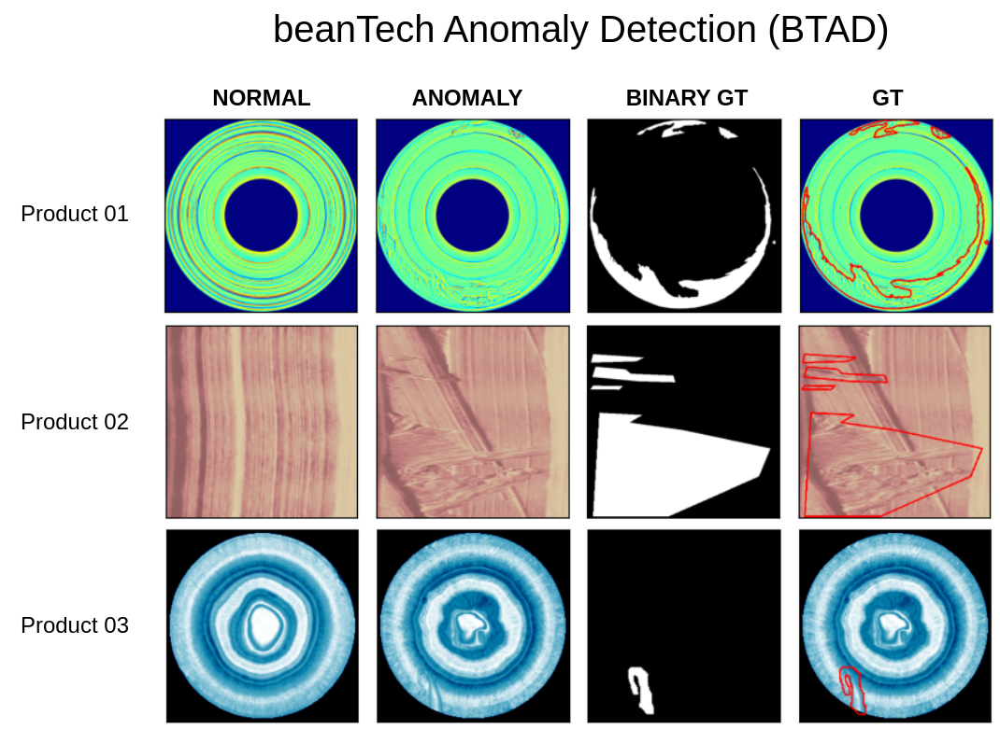

# BTAD: beanTech Anomaly Detection

- Website to the dataset: https://avires.dimi.uniud.it/papers/btad/btad.zip (Source: BeanTech srl)

## Structure
- Contain 3 folders as 3 categories
- Folder structure for each category:
  - ground_truth: contains ground truth binary masks for testing
  - test: contains samples for testing (good and defects)
  - train: contains good samples for training