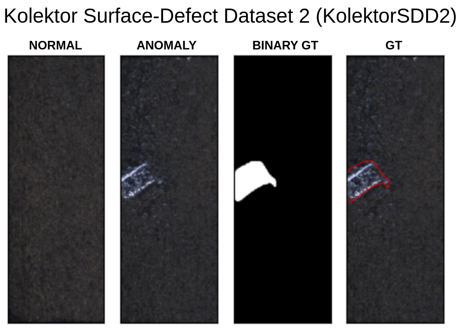

# KolektorSDD2: Kolektor Surface-Defect Dataset 2

- Website to the dataset: https://www.vicos.si/resources/kolektorsdd2

## Structure
- Contain 3 folders:
  - ground_truth: contains ground truth binary masks for testing
  - test: contains samples for testing (good and defects)
  - train: contains good samples for training