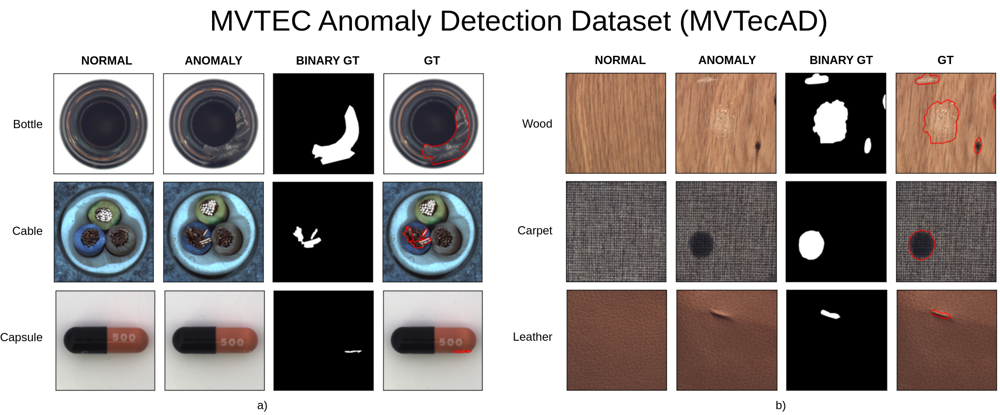

# MVTecAD: MVTEC Anomaly Detection Dataset

- Website to the dataset: https://www.mvtec.com/company/research/datasets/mvtec-ad

## Structure
- Contain 15 folders as 15 categories
- Folder structure for each category:
  - ground_truth: contains ground truth binary masks for testing
  - test: contains samples for testing (good and defects)
  - train: contains good samples for training
