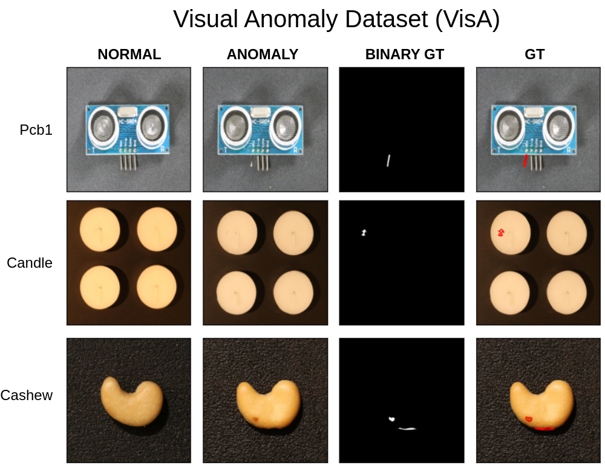

# MVTecAD: MVTEC Anomaly Detection Dataset

- Website to the dataset: https://amazon-visual-anomaly.s3.us-west-2.amazonaws.com/VisA_20220922.tar

## Structure
- Contain 12 folders as 12 categories
- Folder structure for each category:
  - ground_truth: contains ground truth binary masks for testing
  - test: contains samples for testing (good and defects)
  - train: contains good samples for training
